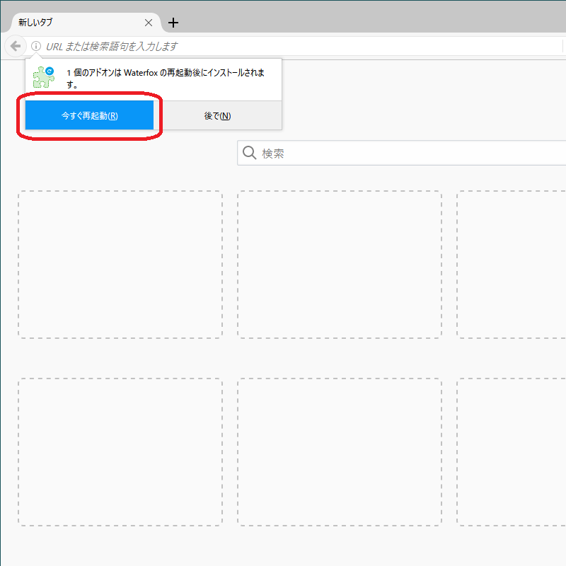

# Waterfox に Greasemonkey 3.17 をインストールする手順
## このドキュメントの概要
- Waterfox 自体のインストールは終わっているものとします。
- 別途 Greasemonkey 3.17 も手元に用意済みとします。

1. 日本語化
1. Greasemonkey 3.17 のインストール
1. Greasemonkey の自動更新を停止
1. おすすめ設定


# 日本語化
## オプションを開く
右上のメニューアイコンをクリックし、`Options`をクリックします。


## 日本語を選択
1. サイドメニューで`General`を選択します。
1. `Startup`内にある`Always check if Waterfox is your default browser`のチェックを外します。
    - Waterfox起動時に毎回、既定のブラウザーになっていない場合に既定のブラウザーにするかの問い合わせを行なうかの設定です。Waterfoxはブラ三専用として使うのでチェックを外しておきます。
1. `Locale Select`の▼をクリックし、`Japanese - 日本語`を選択します。
1. その下にある`Restart`ボタンをクリックします。
1. Waterfoxが再起動するのを待って次の手順へ


## Waterfoxの自動更新を停止（任意）
Waterfoxの自動更新を停止します。
アップデートして意図せず動作しなくなることを抑制します。

常用するブラウザーであればセキュリティリスクがあるので推奨しませんが、ブラ三専用なので。（あと、ブラウザーの起動速度向上が期待できるかもしれない。）

基本的には更新内容を自分で確認して、適用するかどうか決めるのがいいと思います。


# Greasemonkey 3.17 のインストール
ローカルからの xpi インストールには下記手順が必要になります。

## `about:config`を開く
1. アドレスバーに`about:config`と入力してEnterを押下します。
1. 「動作保証対象外になります！」と表示されますが、「危険性を承知の上で使用する」をクリックします。


## アドオンのインストール制限を解除
Waterfoxでは、デフォルトでは、ホワイトリストにあるURL以外からのアドオンのインストールは禁止されています。ローカルからのドラッグ＆ドロップも受け付けないので、一時的にその設定を無効化します。

1. 検索バーに`xpin`まで入れると設定がフィルターされます。
1. `xpinstall.whitelist.required`の値をダブルクリックして、設定を`false`へ変更します。
    - 後述のGreasemonkeyのインストール完了後は、設定を戻した方がいいと思います。


## Greasemonkey 3.17 のインストール
Greasemonkeyの.xpiファイルをWaterfox画面へドラッグ＆ドロップします。


## アドオン追加時の警告
下記の警告が出る場合がありますが、そのまま「追加」をクリックします。


## Waterfoxを再起動
アドオンのインストールはWaterfoxを再起動後に行われるため、案内に従って「今すぐ再起動」をクリックします。



# Greasemonkey の自動更新を停止
このまま何もしないと、自動で Greasemonkey 4 系にアップデートされてしまうので、それを抑制します。

## アドオンマネージャーを開く
1. Waterfoxを開いて、Altキーを押して、離します。
1. メニューバーが表示されるので、ツール＞アドオンを選択します。
    - キーボードで `Ctrl+Shift+A` を押してもOK


## 拡張機能を開く
1. サイドメニューから`拡張機能`を選択します。
1. 右側に表示されたGreasemonkeyの`詳細`をクリックします。


## Greasemonkey 自体の自動更新設定
自動更新の設定を`オフ`に設定します。


# おすすめ設定
## ブックマークツールバーを常に表示する
1. Waterfoxを開いて、Altキーを押して、離します。
1. メニューバーが表示されるので、表示＞ツールバー＞ブックマークツールバーを選択します。


## ブックマークに `bro3-tools`を入れておく
1. https://github.com/RAPT21/bro3-tools を開きます。
1. アドレスバーの鍵アイコンをブックマークツールバーへドラッグ＆ドロップします。


## プロファイルを指定して起動
アプリ起動ショートカットに ` -no-remote -P "プロファイル名"` を追加します。

元のショートカットが `"C:\Program Files\Waterfox Classic\waterfox.exe"` で、プロファイル `default` を使う場合、
`"C:\Program Files\Waterfox Classic\waterfox.exe" -no-remote -P "default"` を設定します。

# 備考
下記のアラートが出る場合がありますが、基本的には「OK」で閉じることを推奨します。

> アクセシビリティ機能は Waterfox の新機能と互換性の問題のため、部分的に無効になっています。

「マルチプロセス Waterfox を有効にする」 とのトレードオフのようで、「有効にして再起動」を選択すると、「マルチプロセス Waterfox を有効にする」 のチェックが外れるようです。


## 資料
[野良署名した検証用 Greasemonkey 3.17](../Sample/my-greasemonkey-317.xpi)

# 技術メモ

## 「マルチプロセス Waterfox を有効にする」 のチェックがで外され、チェックできなくなる場合の対処
`about:config`にて下記設定を行い、Waterfox を再起動することで解消する模様。
何度も設定が復活する場合があるが、繰り返し再設定することでそのうち設定できる模様。

- `accessibility.loadedInLastSession` → デフォルト`false`にする
- `accessibility.lastLoadDate` → 値を右クリックして「リセット」を選択

## Waterfox の自動アップデートを管理者で禁止する設定
参考文献: [設定の管理#設定を管理者が管理したい](https://www.mozilla.jp/business/faq/tech/setting-management/)

`Waterfox.exe` のインストール場所が `C:\Program Files\Waterfox Classic\Waterfox.exe` だった場合の例。

編集権限がなくファイルを直接編集できない場合は、権限があるディレクトリーで編集して、エクスプローラーでドラッグ＆ドロップでコピーすればよい。

### 1. policies.json
`C:\Program Files\Waterfox Classic\distribution\policies.json`

※`distribution`ディレクトリーがない場合は作成する。

```json
{
  "policies": {
    // Waterfox の自動更新を禁止する
    "DisableAppUpdate": true,

    // アドオンの自動更新を禁止する
    "ExtensionUpdate": false,

    // システムアドオンの更新を禁止する
    "DisableSystemAddonUpdate": true
  }
}
```

### 2. `about:config`のデフォルト値をoverride
`C:\Program Files\Waterfox Classic\defaults\pref\autoconfig.js`

```js
pref("general.config.filename", "autoconfig.cfg");
pref("general.config.vendor", "autoconfig");
pref("general.config.obscure_value", 0);

// 「globalChrome.css 読み込み用スクリプト」を使用する場合は以下の行も必要です。
pref("general.config.sandbox_enabled", false);
```

`C:\Program Files\Waterfox Classic\autoconfig.cfg`

```js
// 1 行目は必ずコメントとしてください。
lockPref("app.update.enabled", false);
```

#### 確認方法
Waterfox を起動してオプション (設定画面) を開き、詳細 → 更新 と辿って、自動更新に関する設定が `更新の確認は行わない` で固定されグレイアウトされていることを確認する。

#### 詳細情報
ディレクティブ | 概要 | ユーザーによる変更 | ユーザーによる変更が次回起動時に維持されるか
--|--|--|--
defaultPref("設定名", 値) | 初期値 | 〇 | 〇
pref("設定名", 値) | 初期値 | 〇 | ×（次回起動時には、ここで指定した値に戻る）
lockPref("設定名", 値) | 設定を固定 | × | ─


# 免責
本リポジトリー内の内容によって何らかの不利益を被った場合でも一切責任は取りかねます。すべて自己責任でお願いします。
